# Mermaid.js 다이어그램 문법 가이드

Neural Map에서 사용하는 Mermaid 다이어그램 타입별 상세 문법 레퍼런스

---

## 1. Flowchart (플로우차트)

### 기본 구조
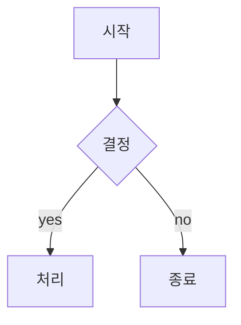

### 방향 지정
- `TD` / `TB`: 위에서 아래 (Top to Down/Bottom)
- `LR`: 왼쪽에서 오른쪽 (Left to Right)
- `RL`: 오른쪽에서 왼쪽
- `BT`: 아래에서 위

### 노드 모양

| 문법 | 모양 | 용도 |
|------|------|------|
| `A[텍스트]` | 사각형 | 일반 프로세스 |
| `B(텍스트)` | 둥근 모서리 | 시작/종료 |
| `C{텍스트}` | 다이아몬드 | 결정/분기 |
| `D[(텍스트)]` | 원통형 | 데이터베이스 |
| `E{{텍스트}}` | 육각형 | 준비/설정 |
| `F[["텍스트"]]` | 서브루틴 | 미리 정의된 프로세스 |

### 연결선 종류

| 문법 | 선 종류 | 화살표 |
|------|---------|--------|
| `A --> B` | 실선 | 있음 |
| `A --- B` | 실선 | 없음 |
| `A -.-> B` | 점선 | 있음 |
| `A ==> B` | 굵은 실선 | 있음 |
| `A -->|텍스트| B` | 실선 + 레이블 | 있음 |

### 서브그래프
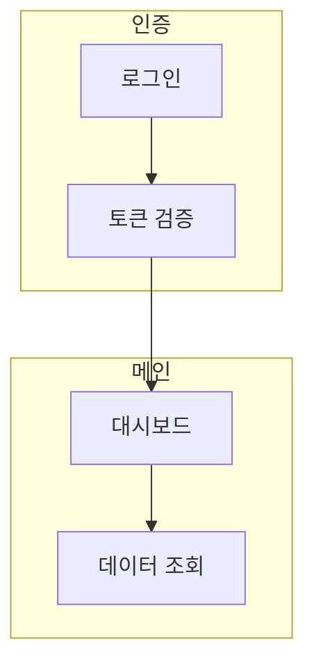

### 스타일링
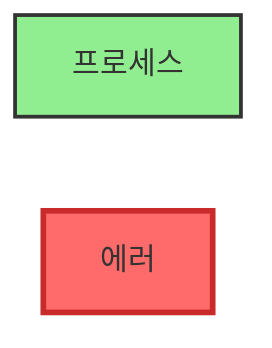

---

## 2. Sequence Diagram (시퀀스 다이어그램)

### 기본 구조
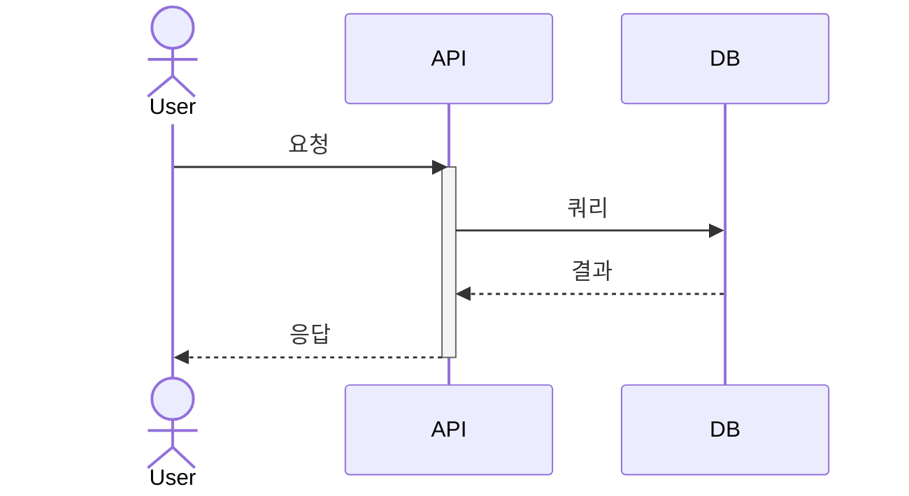

### 참여자 타입

| 키워드 | 심볼 | 용도 |
|--------|------|------|
| `actor` | 사람 아이콘 | 사용자, 외부 액터 |
| `participant` | 사각형 | 시스템, 컴포넌트 |
| `boundary` | 경계선 | API 경계 |
| `control` | 원형 | 컨트롤러 |
| `entity` | 실린더 | 엔티티, 모델 |
| `database` | DB 아이콘 | 데이터베이스 |

### 메시지 타입

| 화살표 | 의미 | 사용 예 |
|--------|------|---------|
| `->>` | 실선 화살표 | 동기 호출 |
| `-->>` | 점선 화살표 | 응답 |
| `-x` | X 표시 | 실패/취소 |
| `-)` | 비동기 화살표 | 비동기 호출 |

### 활성화 박스
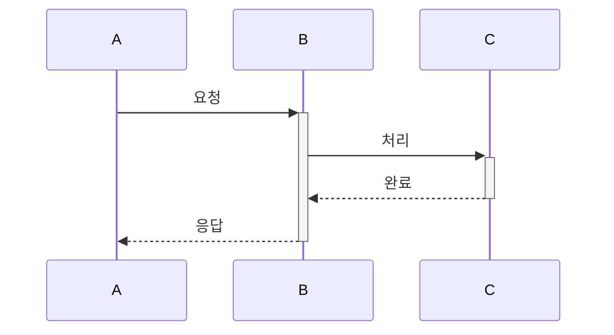

### 제어 구조
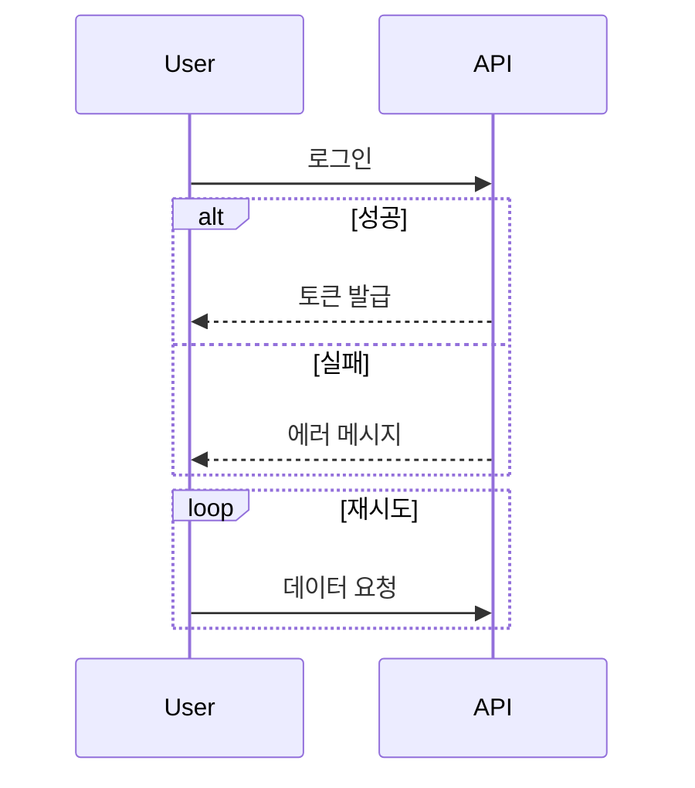

### 노트
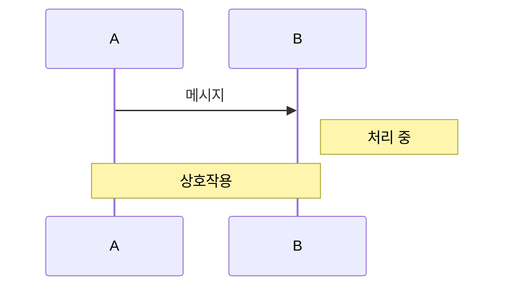

---

## 3. Class Diagram (클래스 다이어그램)

### 기본 구조
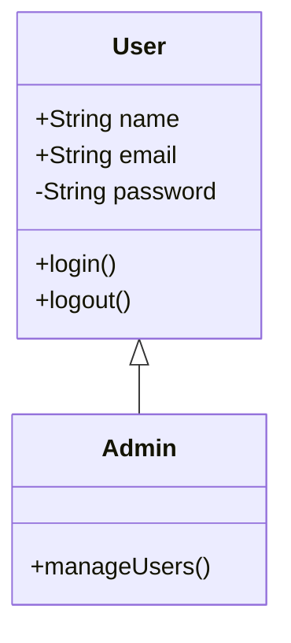

### 접근 제어자

| 기호 | 의미 | 예시 |
|------|------|------|
| `+` | Public | `+getName()` |
| `-` | Private | `-password` |
| `#` | Protected | `#validateEmail()` |
| `~` | Package | `~helper()` |

### 관계 타입

| 기호 | 관계 | 의미 |
|------|------|------|
| `<\|--` | 상속 | A는 B를 상속 |
| `*--` | 합성 | A는 B를 포함 (강한 관계) |
| `o--` | 집합 | A는 B를 포함 (약한 관계) |
| `-->` | 연관 | A는 B를 사용 |
| `..\|>` | 실현 | A는 B 인터페이스 구현 |
| `..>` | 의존 | A는 B에 의존 |

### 멤버 분류자

| 기호 | 의미 | 예시 |
|------|------|------|
| `*` | 추상 | `+login()*` |
| `$` | 정적 | `+getInstance()$` |

### 제네릭과 어노테이션
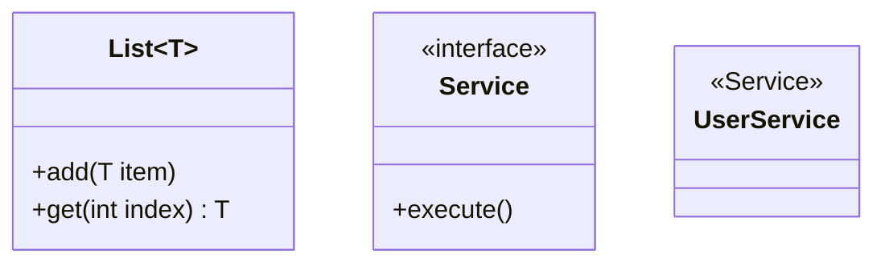

### 카디널리티
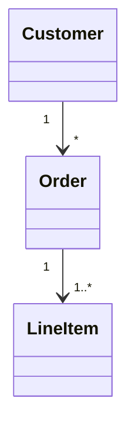

---

## 4. ER Diagram (엔티티 관계도)

### 기본 구조
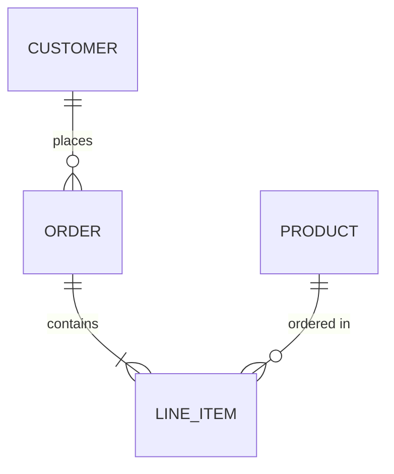

### 카디널리티 표기

| 왼쪽 | 오른쪽 | 의미 |
|------|--------|------|
| `\|o` | `o\|` | 0개 또는 1개 |
| `\|\|` | `\|\|` | 정확히 1개 |
| `}o` | `o{` | 0개 이상 |
| `}\|` | `\|{` | 1개 이상 |

### 관계 타입

| 기호 | 선 종류 | 의미 |
|------|---------|------|
| `--` | 실선 | 식별 관계 |
| `..` | 점선 | 비식별 관계 |

### 속성 정의
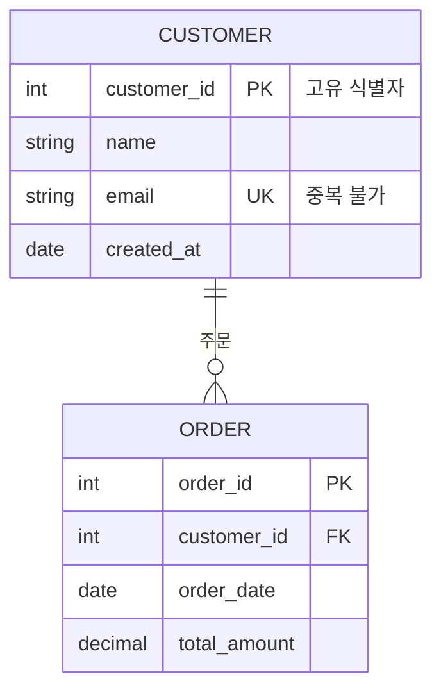

### 관계 예시

| 관계 | 표기 | 예시 |
|------|------|------|
| 1:1 | `\|\|--\|\|` | 사용자 ↔ 프로필 |
| 1:N | `\|\|--o{` | 부서 ↔ 직원들 |
| N:M | `}o--o{` | 학생들 ↔ 수업들 |

---

## 5. Pie Chart (파이 차트)

### 기본 구조
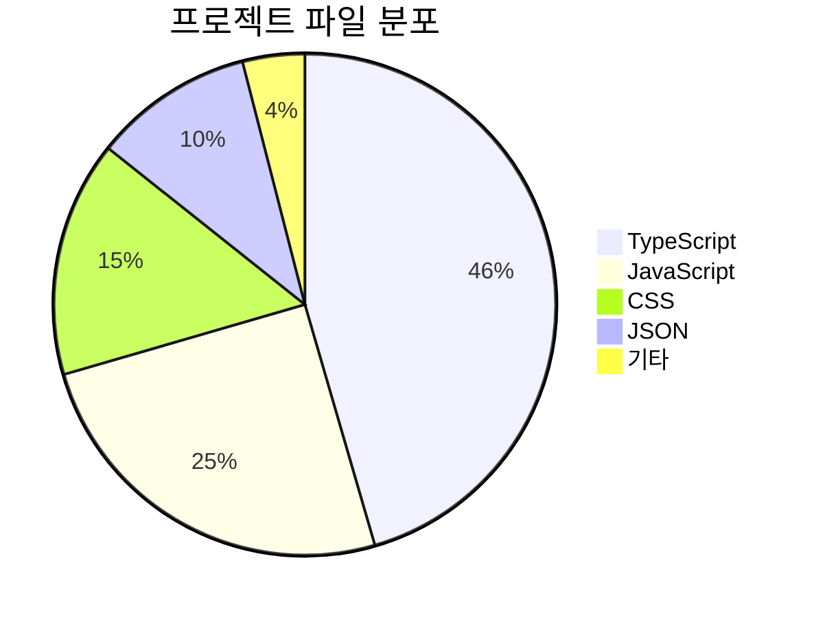

### 옵션

| 키워드 | 효과 |
|--------|------|
| `title` | 차트 제목 |
| `showData` | 실제 값 표시 |

### 데이터 입력 규칙
- 양수만 허용 (소수점 2자리까지)
- 레이블은 따옴표로 감싸기
- 입력 순서대로 시계방향 정렬

### 실용 예시
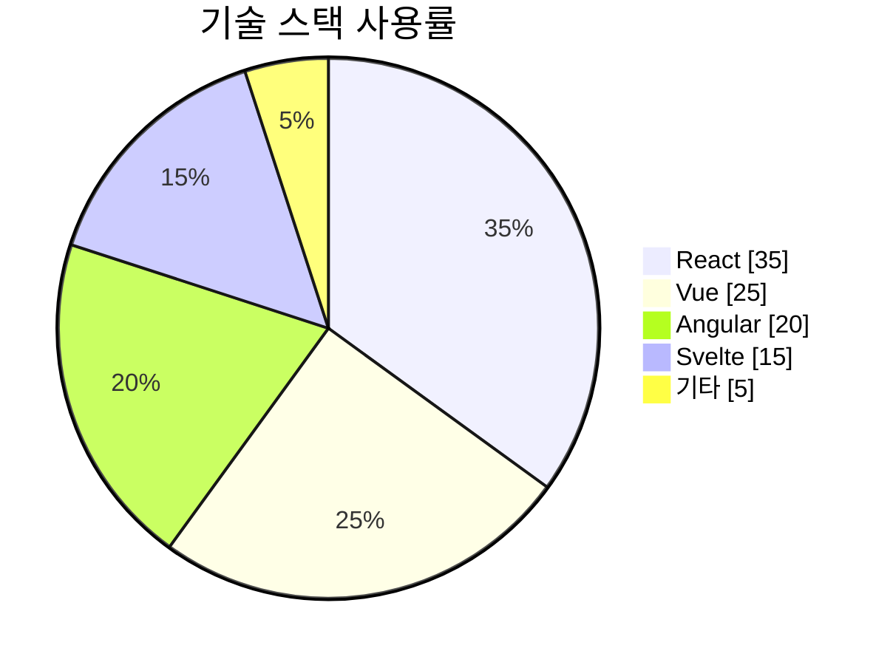

---

## 6. State Diagram (상태 다이어그램)

### 기본 구조
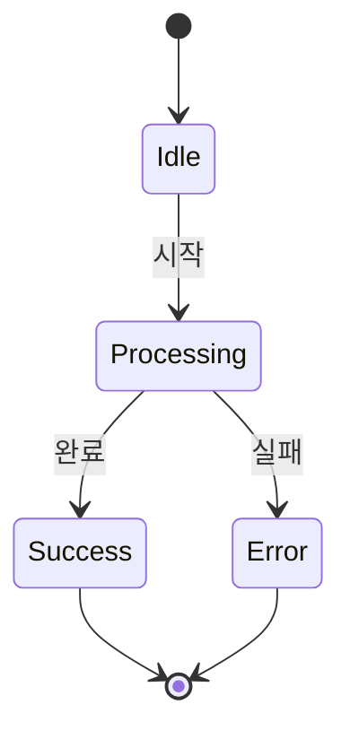

### 상태 정의
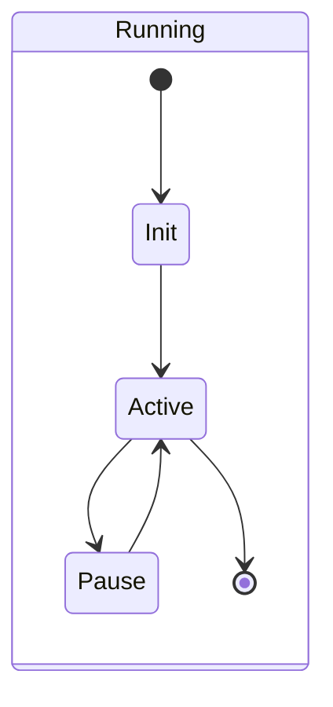

### 복합 상태
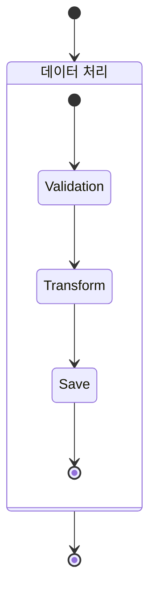

### 병렬 상태
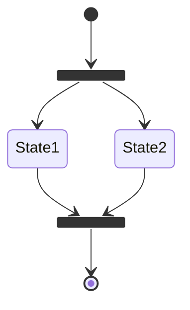

### 노트
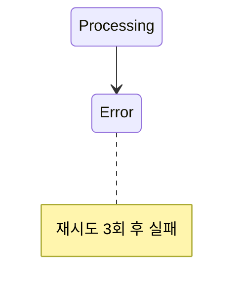

---

## 7. Git Graph (Git 브랜치 시각화)

### 기본 구조
```mermaid
gitgraph
    commit id: "Initial commit"
    branch develop
    commit id: "Add feature"
    checkout main
    commit id: "Hotfix"
    merge develop tag: "v1.0.0"
```

### 커밋 타입

| 타입 | 모양 | 용도 |
|------|------|------|
| `NORMAL` | 원형 | 일반 커밋 |
| `REVERSE` | 교차형 | 되돌림 커밋 |
| `HIGHLIGHT` | 사각형 | 중요 커밋 |

### 브랜치 작업
```mermaid
gitgraph
    commit
    branch feature
    commit
    commit
    checkout main
    commit
    merge feature
```

### 태그와 ID
```mermaid
gitgraph
    commit id: "init"
    commit id: "feat-auth" tag: "v0.1"
    commit id: "fix-bug"
    commit id: "release" tag: "v1.0.0" type: HIGHLIGHT
```

### 체리픽
```mermaid
gitgraph
    commit id: "A"
    branch develop
    commit id: "B"
    commit id: "C"
    checkout main
    cherry-pick id: "B"
```

### 설정 옵션
```javascript
%%{init: {
  'gitGraph': {
    'showBranches': true,
    'showCommitLabel': true,
    'mainBranchName': 'main',
    'parallelCommits': true
  }
}}%%
```

---

## 실전 활용 팁

### 1. 코드 가독성
- 들여쓰기로 계층 구조 표현
- 의미 있는 ID와 레이블 사용
- 적절한 공백과 줄바꿈

### 2. 성능 최적화
- 너무 많은 노드/엣지 지양 (50개 이하 권장)
- 복잡한 다이어그램은 서브그래프로 분리
- 불필요한 스타일링 최소화

### 3. 디버깅
- Mermaid Live Editor (https://mermaid.live)에서 테스트
- 브라우저 콘솔 에러 메시지 확인
- 문법 오류는 렌더링 실패로 표시됨

### 4. Neural Map 통합
- Auto 모드: 프로젝트 데이터로 자동 생성
- Manual 모드: 직접 코드 편집
- 다이어그램 타입 전환 시 자동 재생성

---

**참고**: 모든 예제는 Neural Map의 Mermaid 뷰에서 바로 사용 가능합니다.

**공식 문서**: https://mermaid.js.org/intro/
**Live Editor**: https://mermaid.live

**마지막 업데이트**: 2025-12-23
